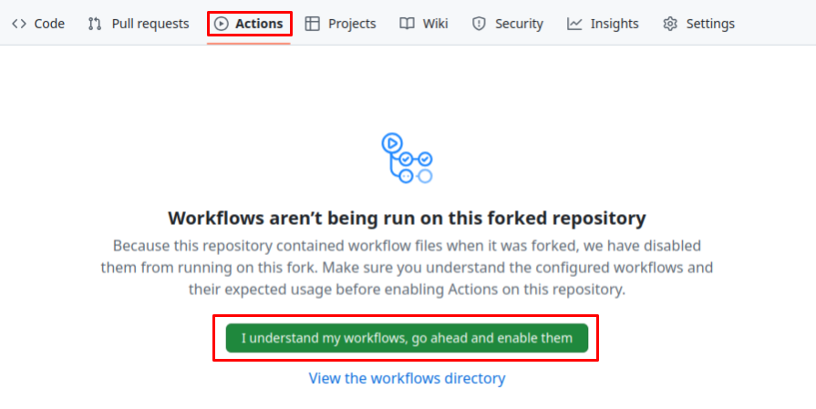
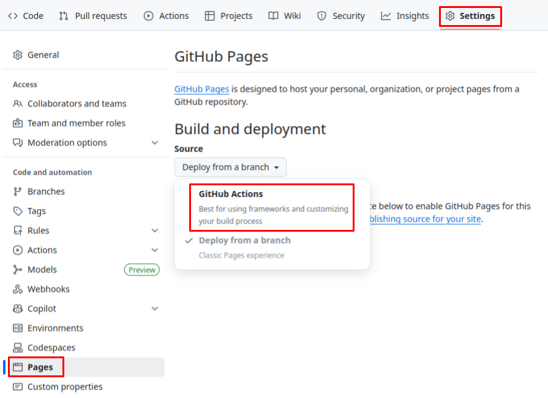
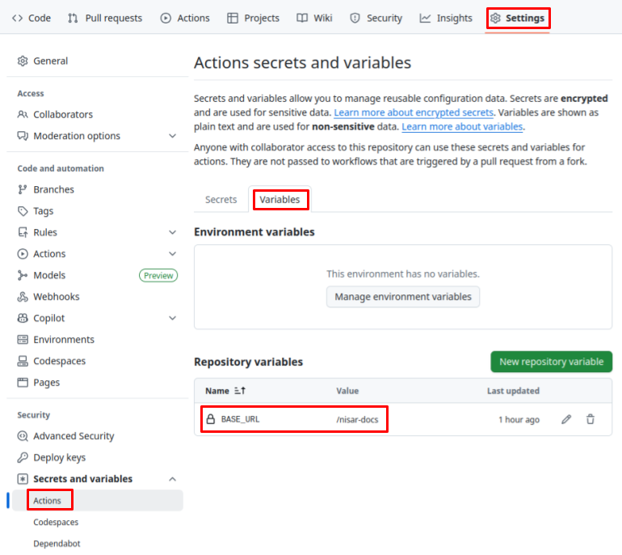

# NISAR Documentation

Source for the public documentation of the NASA-ISRO Synthetic Aperture Radar (NISAR) mission hosted at https://nisar-docs.asf.alaska.edu.

## Contributing

1. Create a fork of https://github.com/ua-asf/nisar-docs/
1. Clone the repository and navigate to the repository root
1. Create and activate the conda environment
    ```
   mamba env create -f environment.yml
   mamba activate nisar-docs
    ```
1. Run `myst start` to render the website on your local machine
1. Configure previewing via GitHub Pages (optional)
   1. Enable GitHub Actions for your fork
      <details>
      <summary>screenshot</summary>
      
      </details>
   1. Enable GitHub Pages for your fork with Source = GitHub Actions
      <details>
      <summary>screenshot</summary>
      
      </details>
   1. Create a `BASE_URL` variable for GitHub Actions with a value of `/nisar-docs` (including the leading `/`)
      <details>
      <summary>screenshot</summary>
      
      </details>
   1. Push changes to your `main` branch
   1. Preview the rendered site at `https://{github_user_id}.github.io/nisar-docs/`
1. Make and commit your changes
1. Push changes to your fork in GitHub
1. Make sure your branch is synced and up to date with `ua-asf/nisar-docs:main`
1. Open a pull request to `ua-asf/nisar-docs:main`
