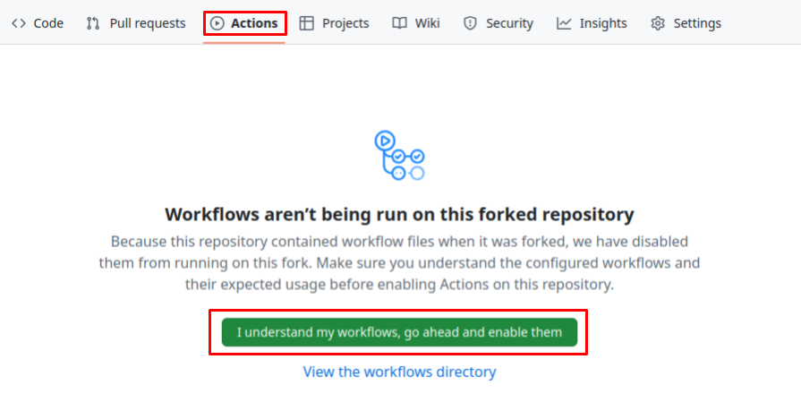
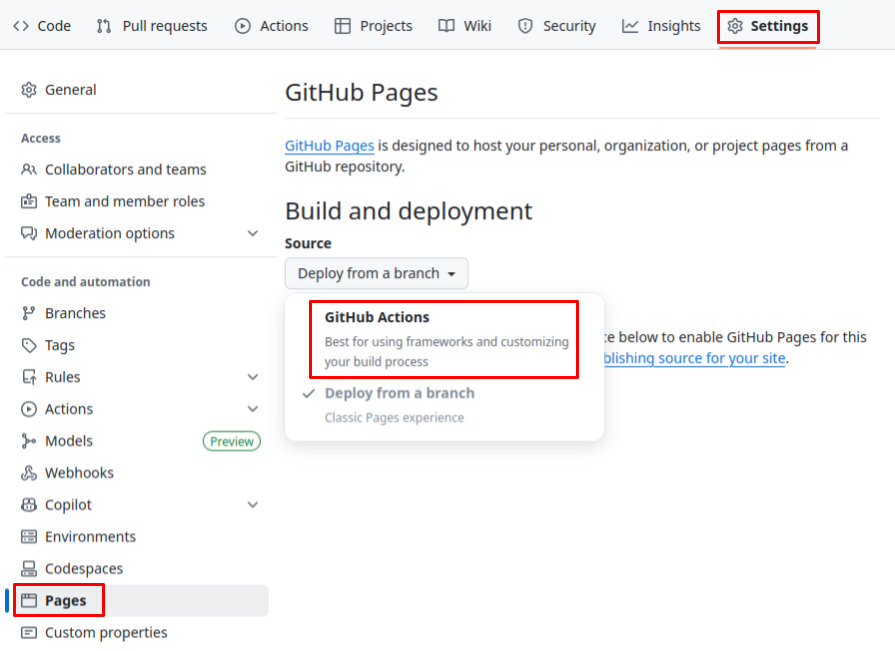

# NISAR Data User Guide

Source for the public documentation of the NASA-ISRO Synthetic Aperture Radar (NISAR) mission hosted at https://nisar-docs.asf.alaska.edu.

## Contributing

1. Create a fork of https://github.com/ua-asf/nisar-docs/
1. Clone the repository and navigate to the repository root
1. Create and activate the conda environment
    ```
   mamba env create -f environment.yml
   mamba activate nisar-docs
    ```
1. Run `myst start` to render the website on your local machine
1. Configure previewing via GitHub Pages (optional)
   1. Enable GitHub Actions for your fork
      <details>
      <summary>screenshot</summary>
      
      </details>
   1. Enable GitHub Pages for your fork with Source = GitHub Actions
      <details>
      <summary>screenshot</summary>
      
      </details>
   1. Create two GitHub Actions variables:
      1. `BASE_URL` with a value of `/nisar-docs` (including the leading `/`)
      2. `DOMAIN` with a value of `https://{github_user_id}.github.io`
      <details>
      <summary>screenshot</summary>
      
      </details>
   1. Push changes to your `main` branch
   1. Preview the rendered site at `https://{github_user_id}.github.io/nisar-docs/`
1. Make and commit your changes
1. Push changes to your fork in GitHub
1. Make sure your branch is synced and up to date with `ua-asf/nisar-docs:main`
1. Open a pull request to `ua-asf/nisar-docs:main`

### Page redirects

Renaming the markdown file for an existing content page in nisar-docs changes the URL for that content, which can
result in broken links. Myst does not have a builtin page redirect feature, so we implemented our own solution.

> [!IMPORTANT]
> These steps may change in the future, per https://github.com/ua-asf/nisar-docs/issues/93.  
> This section will be updated if a new approach is implemented.

To add a new page redirect, follow the steps below (for example, to redirect page `/foo` to `/bar`):

1. Create a new subdirectory in [`redirects`](./redirects/) with the same name as the old page, e.g. `redirects/foo`.
1. Copy the `index.html` file from one of the existing subdirectories into your new subdirectory,
   then edit the file to update all occurrences of the redirect URL.
   For example, copy [`redirects/product-limitations/index.html`](./redirects/product-limitations/index.html)
   to `redirects/foo/index.html` and then replace all references to `/product-known-issues` in the file with `/bar`.
1. Because the redirect feature depends on some custom build steps in the [deploy workflow](./.github/workflows/deploy.yml),
   you won't be able to test your new redirect locally.
   You'll need to push to a fork with GitHub Pages enabled (see [Contributing](#contributing)) to verify redirect behavior.
1. After the site for your fork has successfully rendered, confirm that `/foo` redirects to `/bar`.
