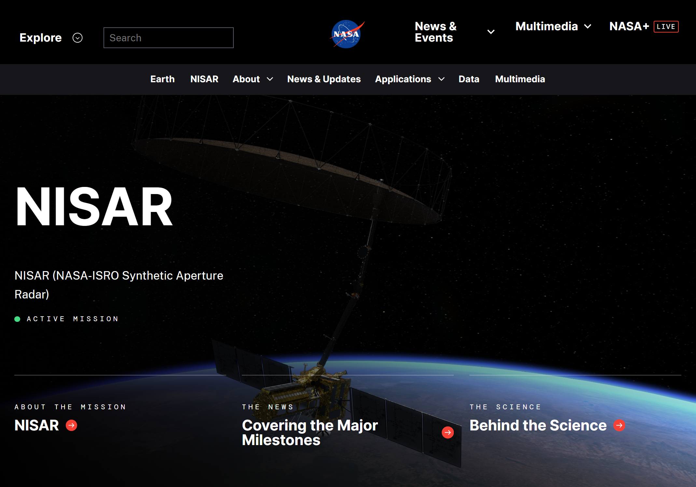
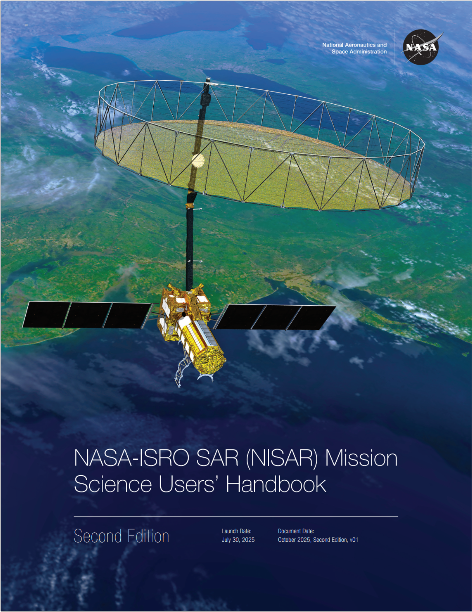

# About NISAR

## Introduction

### The NISAR Mission

NISAR is a joint Earth-observing mission between the [National Aeronautics and Space Administration (NASA)](https://www.nasa.gov/) and the [Indian Space Research Organization (ISRO)](https://www.isro.gov.in/), with the goal to make global measurements of the causes and consequences of land surface changes using advanced radar imaging. Access to NISAR mission data is free and open.

<!-- TODO: add basic content about the SAR sensor (L-band, etc.) -->

The mission concept and the resulting partnership were in response to the [National Academy of Science's 2007 Decadal Survey](https://doi.org/10.17226/11820) [@decadalSurvey2007] of Earth observational priorities for the next decade. 

One of the top priorities identified in this survey was to gain data and insight in three Earth science domains:
* Ecosystems
* Deformation of Earth's Crust 
* Cryospheric Sciences

Refer to NASA's [NISAR Mission](https://science.nasa.gov/mission/nisar/) website for more information.

<a href="https://science.nasa.gov/mission/nisar/">

</a>

### NISAR Science Objectives

The NISAR Mission Science Users' Handbook [@nisarMissionHandbook2025] defines the key scientific objectives as follows:

>NISAR addresses the needs of Solid Earth, Ecosystems, Cryospheric, and Soil Moisture science disciplines, with a specific focus on the following key scientific objectives to:
>
>1. Determine the likelihood of earthquakes, volcanic eruptions, landslides, and land subsidence
>2. Understand the dynamics of carbon storage and uptake in wooded, agricultural, wetland, and permafrost systems
>3. Understand the response of ice sheets to variations in the climate, the interaction of sea ice and climate, and impacts on sea level rise worldwide
>4. Constrain global patterns of soil moisture and their temporal variability, across a wide range of land cover types and climate regimes

### NISAR Mission Science Users' Handbook

The [NASA-ISRO SAR (NISAR) Mission Science Users' Handbook](https://doi.org/10.48577/jpl.UD4HV3) [@nisarMissionHandbook2025] provides a wealth of information about all aspects of the mission. It describes the mission goals, requirements, characteristics and instrumentation. It also provides an overview of the mission data products and the range of scientific applications supported by the mission. 

Published by [JPL](#jet-propulsion-laboratory), this valuable resource is a PDF publication available online. It is a large document that can either be viewed directly in a browser or downloaded for offline use.

Note that all references to the NISAR Mission Science Users' Handbook on this site link to the second edition, which was published in 2025. This edition supersedes the previous edition, published in 2019, and we advise users to reference this second edition instead of the older publication.

<a href="https://doi.org/10.48577/jpl.UD4HV3">

</a>

(jet-propulsion-laboratory)=
### Jet Propulsion Laboratory

The [Jet Propulsion Laboratory (JPL)](https://www.jpl.nasa.gov/) is located on the outskirts of Pasadena, California. Founded in 1936 by California Institute of Technology (Caltech) researchers, JPL is a research and development lab federally funded by NASA and managed by Caltech.

JPL leads the U.S. portion of the NISAR project on behalf of NASA, including project management, providing physical components of the satellite, testing, coordinating science product development, developing and processing data products, and publishing product specifications and algorithm theoretical basis documents. 

JPL generates a suite of products from NISAR mission data, ranging from Level 0 to Level 3, which ASF makes available to the public. Refer to the [data products](#data-products-overview) section of this site for more information on NISAR data products. 

### Alaska Satellite Facility

The [Alaska Satellite Facility (ASF)](https://asf.alaska.edu/) Distributed Active Archive Center (DAAC) has been selected to archive the data from the NISAR mission. ASF maintains the NASA archive of Synthetic Aperture Radar (SAR) data from various satellites and aircraft, providing these data and associated services to the public in support of NASA’s Earth Science Data and Information System ([ESDIS](https://earthdata.nasa.gov/about/esdis-project?_ga=2.174193322.963840534.1558367114-1499519562.1541105389)) project.

ASF will utilize NASA's [Earthdata Cloud](https://www.earthdata.nasa.gov/about/earthdata-cloud-evolution) for processing, storage and distribution of the data. This environment leverages Amazon Web Service (AWS) infrastructure, allowing datasets to be accessed directly and efficiently in cloud computing workflows. 

## Instrumentation

NISAR was designed to deliver global coverage at full resolution and with polarimetric diversity. The technical innovation that allows this performance is the scan-on-receive SweepSAR design, conceived and refined collaboratively by NASA and the German Space Agency (DLR).

```{figure} ../assets/sweep-sar.png
:label: sweep-sar
:alt: Figure illustrating the SweepSAR approach to imaging
:align: center

SweepSAR technique, which allows full-resolution, multipolarimetric observations across an extended swath (> 240 km). By transmitting energy across the full feed aperture, a wide swath is illuminated on the ground. Each patch element on  the feed can receive independently, allowing localization in time, hence space, of the return echo scattered from the ground. *Note: Transmit and scanning receive events overlap in time and space. Alongtrack offset shown is for clarity of presentation only*. Credit: [NISAR Mission Handbook](https://doi.org/10.48577/jpl.UD4HV3) [pg. 44, -@nisarMissionHandbook2025]
```

A more detailed description of the NISAR instrument design is in section 4.7 of the [NISAR Mission Handbook](https://doi.org/10.48577/jpl.UD4HV3) [@nisarMissionHandbook2025].

### Bands

The L-band Synthetic Aperture Radar (L-SAR) instrument is the focus of the NASA-chartered science goals for NISAR, and provides global coverage. The L-SAR is a side-looking, fully polarimetric, interferometric SAR at a wavelength of 24 cm. Most acquisitions have a swath width of about 240 km, an along-track resolution of 7 m, and a cross-track resolution of 2 to 8 m (depending on mode).

The S-band SAR (S-SAR) instrument, developed in a collaboration between NASA and the Indian Space Research Organization (ISRO), operates at a wavelength of 9.3 cm and is primarily used for acquisitions over India.

### Frequencies

NISAR is equipped to acquire data in two slightly different frequencies. @tbl:areas-html summarizes the frequency A and the frequency B settings that define the acquisition modes. For interferometric NISAR products, only frequency A data are used. All other NISAR products can be acquired in a combination of frequency A and frequency B. <!-- TODO: Clarify this statement -->

:::{table} NISAR acquisition modes
:label: tbl:areas-html

<table style="border: 2px solid #000">
    <tr>
        <td rowspan="2" align="center" style="vertical-align: bottom; border: 1px solid #000"><strong>L-band bandwdith [MHz]</strong></td>
        <td colspan="2" align="center" style="border: 1px solid #000"><strong>Center frequency [MHz]</strong></td>
    </tr>
    <tr>
        <td align="center" style="border: 1px solid #000"><strong>Frequency A</strong></td>
        <td align="center" style="border: 1px solid #000"><strong>Frequency B</strong></td>
    </tr>
    <tr>
        <td align="center" style="border: 1px solid #000">77</td>
        <td align="center" style="border: 1px solid #000">1257.5</td>
        <td align="center" style="border: 1px solid #000">NA</td>
    </tr>
    <tr>
        <td align="center" style="border: 1px solid #000">40+5</td>
        <td align="center" style="border: 1px solid #000">1239</td>
        <td align="center" style="border: 1px solid #000">1293.5</td>
    </tr>
    <tr>
        <td align="center" style="border: 1px solid #000">20+5</td>
        <td align="center" style="border: 1px solid #000">1229</td>
        <td align="center" style="border: 1px solid #000">1293.5</td>
    </tr>
    <tr>
        <td align="center" style="border: 1px solid #000">20+20</td>
        <td align="center" style="border: 1px solid #000">1229</td>
        <td align="center" style="border: 1px solid #000">1286</td>
    </tr>
    <tr>
        <td align="center" style="border: 1px solid #000">5+5</td>
        <td align="center" style="border: 1px solid #000">1221.5</td>
        <td align="center" style="border: 1px solid #000">1236.5</td>
    </tr>
</table>
:::

### Polarization

The polarization refers to the direction that an electromagnetic wave travels. This can be horizontal, vertical, or circular. Circular polarizations, where the wave is rotating in a constant plane to the left or right, are much less commonly used for SAR sensors than linear (horizontal or vertical) polarizations. 

<!-- Add figure or link to polarization section in hyp3-docs -->

The antennas of a SAR system can be configured to transmit and receive electromagnetic waves using various combinations of these polarizations. The polarimetric properties of the observed surface can reveal the structure, orientation and environmental conditions of the surface elements.

For the NISAR mission, the combination of polarizations varies based on the acquisition mode, and the 2-digit polarization code is indicated as part of the filename for each data product. Refer to [NISAR Naming Conventions](#naming-convention-overview) to see where the polarization is indicated in the filename. 

The potential polarization configurations for NISAR products are as follows:
- Single polarization
  - SH: HH single-pol data
  - SV: VV single-pol data
- Dual polarization
  - DH: HH+HV dual-pol data 
  - DV: VV+VH dual-pol data
- Quad-pol data
  - QP: HH+HV+VH+VV quad-pol data
- Compact polarization (circular)
  - RH: right-circular HH data 
  - RV: right-circular VV data

<style>section {page-break-before: avoid}</style>