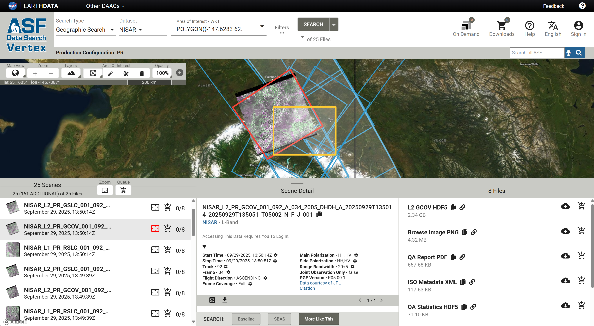

# Access Overview

NISAR mission data products are generated by [JPL](../about-nisar/nisar-intro.md#jet-propulsion-laboratory) and archived by [ASF](../about-nisar/nisar-intro#alaska-satellite-facility). These products, described in the [Data Products section](../data-products/products-overview#data-products-overview), are hosted in [NASA's Earthdata Cloud (EDC)](https://www.earthdata.nasa.gov/about/earthdata-cloud-evolution), which uses AWS infrastructure. This allows users to leverage cloud-based access and computation workflows, though the products can also be downloaded to local storage. 

There are a range of access options available for NISAR, supporting a range of access patterns and analysis workflows. 

:::{important}
There are not yet any NISAR products available to the public. The NISAR mission team is working on validating the products to ensure they meet mission requirements before they are released.

The infrastructure is in place to make the products available as soon as they are approved for release, but the illustrations currently included in this documentation site are examples of what _will_ be possible. The results displayed will not be reproducible until the data is publicly available.
:::

## Map-based Web Applications

Map-based web interfaces make it easy to explore data available for a particular geographic location and visualize the extent and characteristics of the products. 

* ASF's [Vertex](#vertex) data search site is optimized for searching NASA's SAR holdings
* NASA's [Earthdata Search](#earthdata-search) provides access to all of NASA's Earth observation datasets

### Vertex

[Vertex](https://search.asf.alaska.edu/#/) was developed by ASF to facilitate search and discovery specifically for SAR datasets. 

Because search parameters of interest for SAR differ from other types of Earth observation data, it can be helpful to use a platform that is tailored to the parameters and characteristics of SAR data. This is particularly useful for those who are less familiar with SAR data products and may need more guidance to find the appropriate dataset for their use case. 

[Learn more about using Vertex to search for NISAR data!](vertex#vertex-data-search)

### Earthdata Search

## Programmatic Access

The global and reliable regular coverage of the NISAR mission makes it a compelling data source for big data analysis workflows. SAR data is often integrated into complex scripts to perform additional processing and time series analysis, and NISAR data access can be scripted into existing programmatic workflows. 

As with the web-based user interfaces, ASF provides programmatic access patterns tailored to SAR datasets, but NISAR data can also be accessed using programmatic tools developed to support a wide range of NASA Earth observation data resources.

* ASF provides the [asf_search Python package](#asf-search-python-package) to streamline the process of finding and accessing suitable SAR datasets for a time period and area of interest
* The [earthaccess Python package](#earthaccess-python-package) provides programmatic access to a range of NASA Earth observation datasets

### ASF Search Python Package

https://docs.asf.alaska.edu/asf_search/basics/
https://pypi.org/project/asf-search/

### Earthaccess Python Package

https://earthaccess.readthedocs.io/en/stable/

