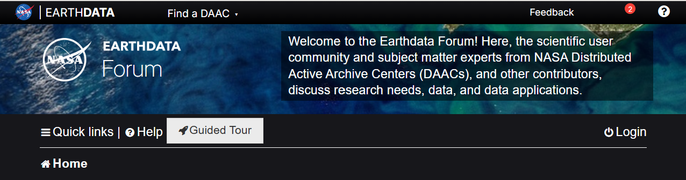

# Contact Information

## Earthdata Forum

NASA's [Earthdata Forum](#nisar-in-earthdata-forum) is the best venue for asking questions and engaging in dialog about NISAR data. Subject-matter experts are able to view and reply to your post, and users are able to reference the validated answers to previously asked questions.

## ASF User Services

Users can also contact ASF directly by emailing [uso@asf.alaska.edu](mailto:uso@asf.alaska.edu).