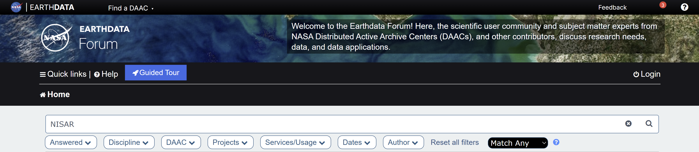
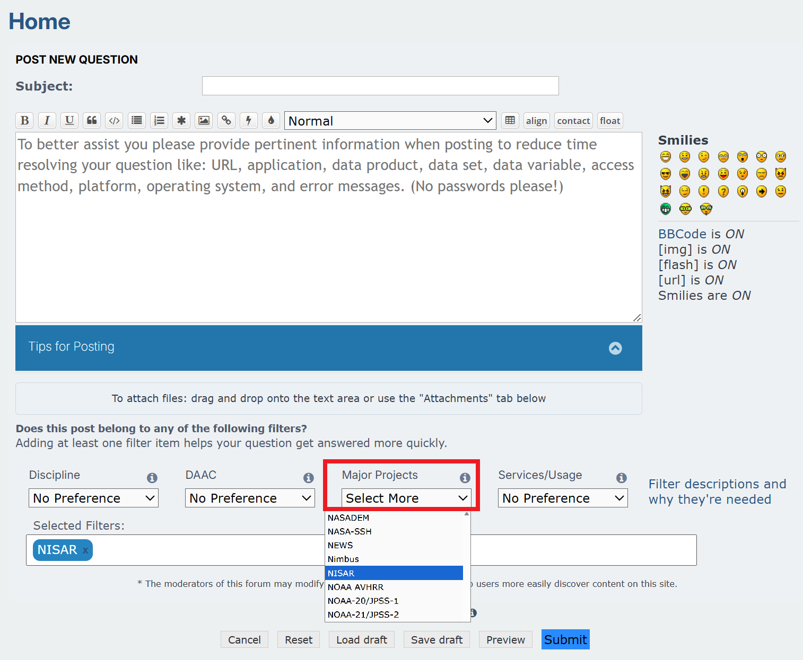

# Earthdata Forum

(nisar-in-earthdata-forum)=
## NISAR in the Earthdata Forum

(earthdata-forum-summary)=
NASA's [Earthdata Forum](https://forum.earthdata.nasa.gov/) is the best venue for asking questions and engaging in dialog about NISAR data. Subject-matter experts are able to view and reply to your post, and users are able to reference the validated answers to previously asked questions.

Users can search for NISAR-related content by [entering ***NISAR*** in the search bar](https://forum.earthdata.nasa.gov/viewforum.php?f=7&&keywords=nisar).

When you [post a new question](https://forum.earthdata.nasa.gov/posting.php?mode=post&f=7&), make sure to add filter tags to ensure that the appropriate subject-matter experts are alerted of your post. 

- Click on the **Major Projects** drop-down menu and select `NISAR` from the options. 
- You may also want to select `ASF` from the **DAAC** drop-down menu, and any other tags that are appropriate to your post. 

