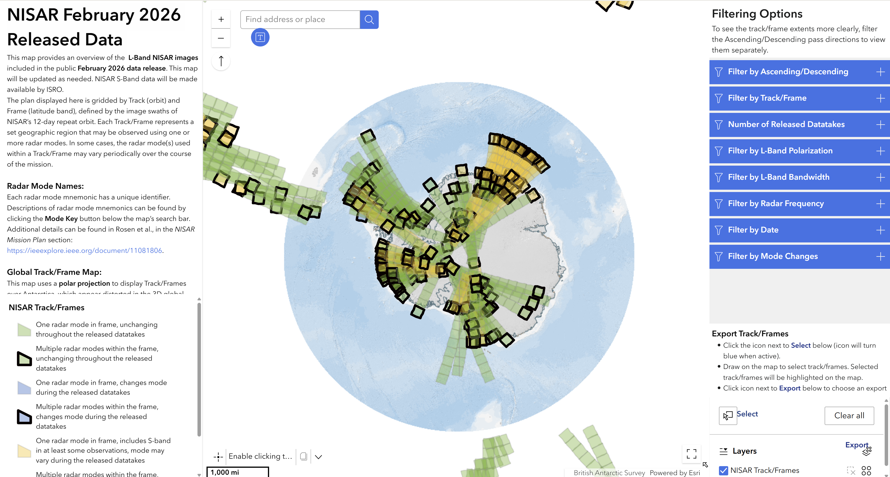
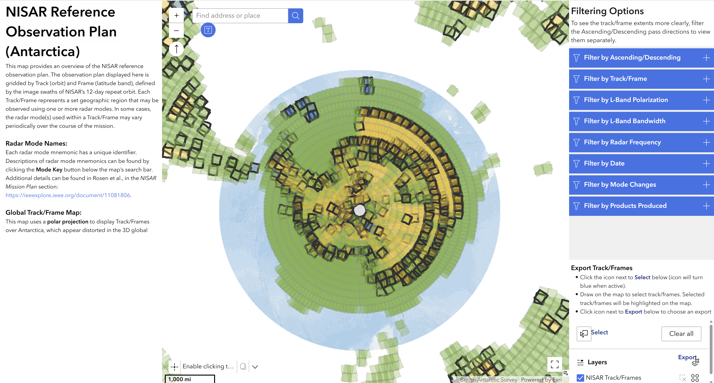

# NISAR Observation Plan

The NISAR observation plan is complex. In order to meet the broad science goals of the mission, different 
radar modes are used to collect data for different geographic areas, as described in the 
[NISAR Observation Strategy](https://science.nasa.gov/mission/nisar/observation-strategy/).

(nisar-reference-observation-plan)=
## NISAR Reference Observation Plan

The reference observation plan for the first six months of the mission is documented in Figure 4-1 of the 
[NISAR Mission Handbook](https://doi.org/10.48577/jpl.UD4HV3), which is replicated here 
in @ref-obs-plan-image for convenience.

```{figure} ../assets/nisar-reference-observation-plan-handbook.png
:name: ref-obs-plan-image
:alt: NISAR Reference Observation Plan, Figure 4-1 in the [NISAR Mission Handbook](https://doi.org/10.48577/jpl.UD4HV3)
:align: left

NISAR Reference Observation Plan coverage maps for global ascending (a) and descending (b) passes, and joint L-band and S-band ascending (c), and descending (d) data takes. This plan will be in place for the initial six months of the mission. 

- The project plans to review and adjust the plan every six months, depending on science team input, available resources, and other programmatic factors. 
- The legend describes the modes that will be employed, including the [mode mnemonic](#mnemonic-scheme).
- There are some variations in coverage seasonally (i.e. over the poles as sea ice comes and goes), but largely the acquisition plan is intended to be static geographically to allow generation of consistent time series over the life of the mission. 
```

(mnemonic-scheme)=
## Mnemonic Scheme

A mnemonic is used to describe each radar mode, which is more informative than simply the mode number. This mnemonic is referenced both in @ref-obs-plan-image and in the [Observation Plan Interactive Apps](#observation-plan-apps).

### L-band Mnemonic Scheme

The mnemonic scheme for L-band radar modes is the following:

**L:CCC:MM:BB<sub>_l_</sub>P<sub>_l_</sub>+BB<sub>_u_</sub>P<sub>_u_</sub>:WW:DD:FFF**

@tbl:l-band-mnemonic-scheme describes each component in the L-band mnemonic scheme. 

:::{table} L-band Mode Mnemonic Scheme
:label: tbl:l-band-mnemonic-scheme
:widths: auto
:align: center

| **Attribute**&emsp; | **Meaning**                                                                                                                                                |
|---------------------|------------------------------------------------------------------------------------------------------------------------------------------------------------|
| L                   | L-band                                                                                                                                                     |
| CCC                 | Mode category (ENG = engineering mode, SCI = science mode, PST = post-take, PRE = pre-take)                                                                |
| MM                  | Mode name (QP = quad pol; DH = dual pol HH/HV; SH = single pol HH; QD = HH in lower band, VV in upper band; QQ = HH/HV in lower band, VV/VH in upper band) |
| BB<sub>_l_</sub>    | Bandwidth of lower band                                                                                                                                    |
| P<sub>_l_</sub>     | Pulse width of lower band (W = wide, M = medium, N = narrow)                                                                                               |
| BB<sub>_u_</sub>    | Bandwidth of upper band                                                                                                                                    |
| P<sub>_u_</sub>     | Pulse width of upper band                                                                                                                                  |
| WW                  | Swath width (FS = full swath 240 km, HS = half swath)                                                                                                      |
| DD                  | Bit depth (B4 = 4 bit quantization, B3 = 3 bit quantization)                                                                                               |
| FFF                 | Pulse repetition frequency scheme (e.g., F28 is fixed PRF scheme, D01, is a variable PRF scheme)                                                           |

:::

### S-band Mnemonic Scheme

The S-band mnemonic scheme is similar to L-band: 

**S:XX:MM:BBP:WW:DD:FFF**

@tbl:s-band-mnemonic-scheme describes each component in the S-band mnemonic scheme. 

:::{table} S-band Mode Mnemonic Scheme
:label: tbl:s-band-mnemonic-scheme
:widths: auto
:align: center

| **Attribute**&emsp; | **Meaning**                                                                                                                                                |
|---------------------|------------------------------------------------------------------------------------------------------------------------------------------------------------|
| S                   | S-band                                                                                                                                                     |
| XX                  | Beam-forming mode (DB = beamform; DR = raw channels of the beamformer; NR = no beamforming)                                                                |
| MM                  | Mode name (QP = quad pol; DH = dual pol HH/HV; SH = single pol HH; QD = HH in lower band, VV in upper band; QQ = HH/HV in lower band, VV/VH in upper band) |
| BB                  | Bandwidth                                                                                                                                                  |
| P                   | Pulse width  (W = wide, M = medium, N = narrow)                                                                                                            |
| WW                  | Swath width (FS = full swath 240 km, HS = half swath)                                                                                                      |
| DD                  | Bit depth (B4 = 4 bit quantization, B3 = 3 bit quantization)                                                                                               |
| FFF                 | Pulse repetition frequency scheme (e.g., F28 is fixed PRF scheme, D01, is a variable PRF scheme)                                                           |

:::

For joint modes, the PRF scheme (FFF in @tbl:s-band-mnemonic-scheme) is left off the mnemonic because it is the same as for L-band.  

(observation-plan-apps)=
## Interactive Apps

The NISAR Reference Observation Plan can be explored interactively using a series of web applications. Apply filters to view the spatial extent of planned L-band acquisitions based on flight direction, track/frame, polarization, bandwidth, frequency, date, mode changes, or product type. Zoom or pan to view your area of interest, and click on a footprint to learn about the acquisition information for that frame. 

There are different applications available, one displaying the currently available set of [pre-calibration data](#feb-2026-obs-plan-app), and the other for the full [reference observation plan](#ref-obs-plan-app) once calibrated data is available. Refer to @availability-overview to view the release timeline for the different collections of data. 

Each of these applications also has a companion app optimized for viewing acquisitions over Antarctica. These apps use a south polar stereographic projection to improve the rendering of frame footprints for Antarctic acquisitions.

(feb-2026-obs-plan-app)=
### Pre-Calibration Data Apps

These applications provide an overview of the L-band NISAR images included in the @nisar-sample-data-feb data release. Click an app image or header to open it in a new tab.

#### [NISAR February 2026 Released Data - Global](https://experience.arcgis.com/experience/0042193b06104889971cd77f505190e0/)

<a href="https://experience.arcgis.com/experience/0042193b06104889971cd77f505190e0/">

</a>

#### [NISAR February 2026 Released Data - Antarctic](https://experience.arcgis.com/experience/8d4533b5909e4ac395acaf6712f58d9f/)

<a href="https://experience.arcgis.com/experience/8d4533b5909e4ac395acaf6712f58d9f/">

</a>

(ref-obs-plan-app)=
### Reference Observation Plan Apps

These applications provide an overview of the L-band NISAR acquisitions that will be available once [calibrated data is released](#timeline-calibrated-forward-processing).

#### [NISAR Reference Observation Plan - Global](https://experience.arcgis.com/experience/6052a864cd01459393884a7f751558e3)

<a href="https://experience.arcgis.com/experience/6052a864cd01459393884a7f751558e3">

</a>

#### [NISAR Reference Observation Plan - Antarctic](https://experience.arcgis.com/experience/83942599aec64c1c8ea8a8b913d22539)

<a href="https://experience.arcgis.com/experience/83942599aec64c1c8ea8a8b913d22539">

</a>


