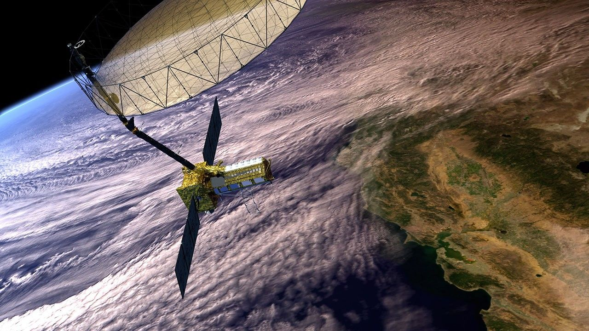

# NISAR Data User Guide

The joint NASA/ISRO Synthetic Aperture Radar (NISAR) platform supports an enhanced understanding of changes occurring on Earth through time. Data from the NISAR mission can be used to monitor ecosystems, ice masses, vegetation biomass, sea level, groundwater dynamics, geophysical processes, and natural hazards.

NISAR's dual-band radar systematically images the Earth's surface, regardless of light or cloud conditions, and can measure surface deformation on the centimeter scale.

All NISAR science data is freely available and open to the public, consistent with the long-standing NASA Earth Science open data policy.

This guide aims to help those who research and monitor the Earth find all the information they need to know about accessing and working with NISAR data in one place. 

_NISAR Satellite in Earth Orbit (Artist's Concept). Credit: NASA/JPL-Caltech_ 

## Citation

To cite content from this user guide, use the reference below or refer to https://doi.org/10.5281/zenodo.20218145 for more citation formats.
