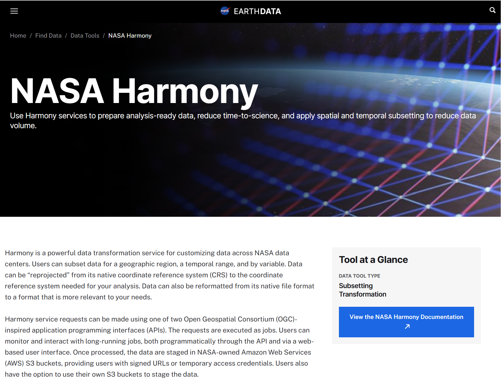
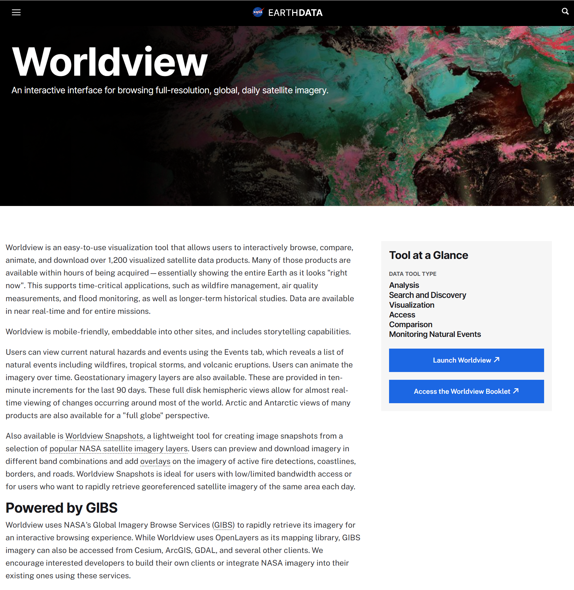

# Tools and Services Overview

## Earthdata Tools and Services

ASF is working in collaboration with other development teams across the Earthdata ecosystem to make NISAR data available using existing Earthdata tools and platforms, including:

- [NASA Harmony](#ed-harmony)
- [Worldview](#ed-worldview)
- [Earthdata GIS (EGIS)](#ed-egis)

Refer to the @tools-services-roadmap to check the status of these development efforts.

(ed-harmony)=
### [NASA Harmony](https://www.earthdata.nasa.gov/data/tools/nasa-harmony)

NASA's [Harmony](https://www.earthdata.nasa.gov/data/tools/nasa-harmony) service allows users to transform NASA datasets, customizing the output to better meet their needs. For NISAR products, Harmony services are being developed to support subsetting by variable or geographic range, with the option for some output products to be generated in a different file format or projection.

(ed-worldview)=
### [Worldview](https://www.earthdata.nasa.gov/data/tools/worldview)

NASA's [Worldview](https://www.earthdata.nasa.gov/data/tools/worldview) is a powerful visualization platform, allowing users to browse hundreds of different NASA datasets. Users can view the extent of available acquisitions through time, compare different datasets or acquisition dates, and generate time series animations. Development is underway for a visualization of the NISAR GCOV products, which we expect to be available on the [Worldview](https://worldview.earthdata.nasa.gov/) platform in July, 2026.

(ed-egis)=
### [Earthdata GIS](https://www.earthdata.nasa.gov/data/tools/earthdata-gis)

NASA's [Earthdata GIS (EGIS)](https://www.earthdata.nasa.gov/data/tools/earthdata-gis) platform provides content that can be leveraged interactively in web maps or applications and GIS software platforms. ArcGIS Image Services allow users to interact with source rasters without having to download the data first, but the NISAR data format makes it challenging to leverage image services without first transforming the source rasters. ASF is working with Esri and the EGIS team to explore potential methods of service publication that minimize storage while still providing a performant user experience.

