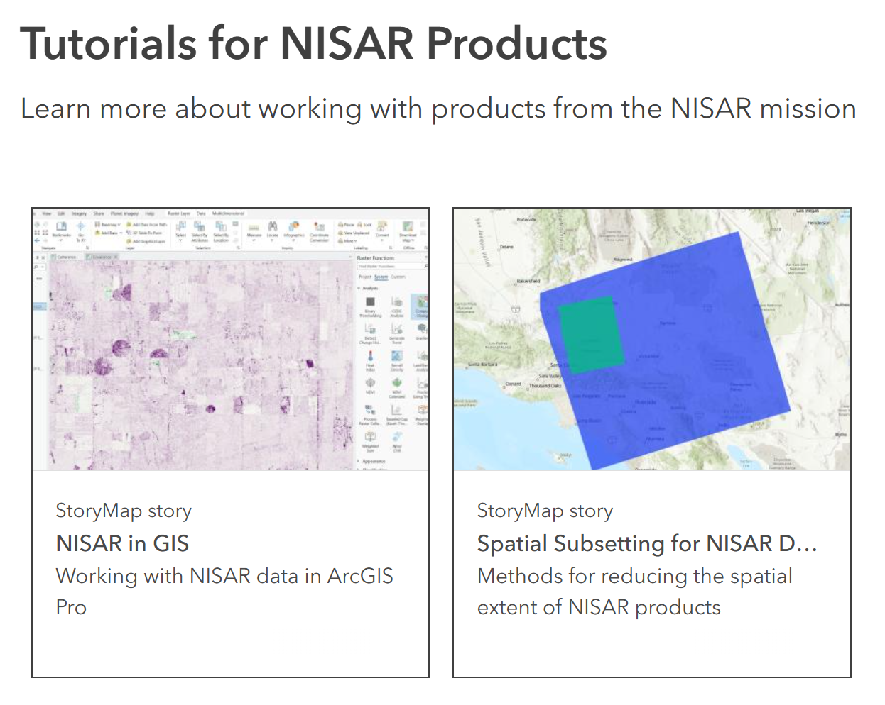
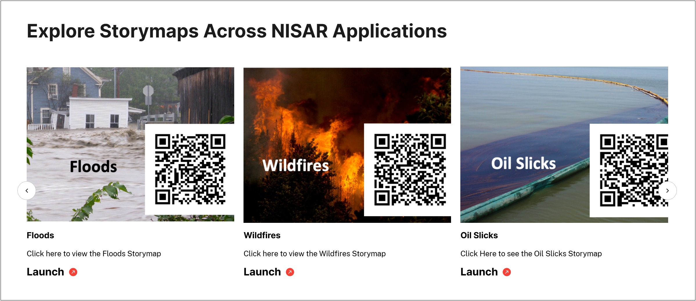

# StoryMap Tutorials

StoryMaps are an interactive web content format, hosted by [Esri](https://www.esri.com/en-us/arcgis/products/arcgis-storymaps/overview), which support interactive geospatial components, making them an engaging tool for presenting and demonstrating geospatial data capabilities. 

<!-- TODO: Differentiate ASF content vs. Mission team content, and potentially embed content or cards for a more visually appealing presentation -->

(nisar-storymaps)=
## NISAR StoryMaps

There are a number of StoryMap tutorials available for NISAR, published both by ASF and the NISAR Mission Team. 

(asf-nisar-storymaps)=
### ASF NISAR StoryMaps

NISAR StoryMaps published by ASF are all displayed in the [ASF ArcGIS Online Gallery](https://asf-daac.maps.arcgis.com/home/gallery.html?sortField=title&sortOrder=asc&categories=%2FCategories%2FNISAR).

They can also be accessed directly:

* [NISAR in GIS](https://storymaps.arcgis.com/stories/c8f85d20b73c48fd8e89f8eef49bc60b) (February 2025\)  
* [Spatial Subsetting for NISAR Data](https://storymaps.arcgis.com/stories/cac03522f82f420ab992316bb935a709) (April 2025\)  

(jpl-nisar-storymaps)=
### JPL NISAR StoryMaps

JPL has published a series of StoryMaps focused on specific applications. These StoryMaps are highlighted on the [NISAR Mission Page](https://science.nasa.gov/mission/nisar/arcgis-storymaps/). 

They can also be accessed directly:

* [Floods](https://storymaps.arcgis.com/stories/c00d7691b8004b20a14f28df710d05fd) (2/16/2023)
* [Wildfires](https://storymaps.arcgis.com/stories/4724cd32c4064b9eb5ebe300c1385d07) (7/16/2024)
* [Land Subsidence](https://storymaps.arcgis.com/stories/109e602e748346f3be8dc89124619828) (3/20/2023)
* [Oil Slicks](https://storymaps.arcgis.com/stories/bda9a0fb909946918579830747a3a2a9) (3/20/2023)
* [Glacial Motion](https://storymaps.arcgis.com/stories/7c674de4e9024a219249627500d2449b) (6/8/2023)
